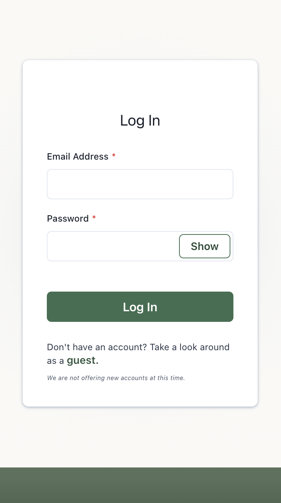

## Welcome to KettlePal!

KettlePal was built for two reasons:

1. To gain hands-on experience building a production grade full-stack application.
2. To quantitiatively track my kettlebell workouts over time, helping overcome plateaus by systematically increasing work capacity.

KettlePal has a small, but growing user-base. To cover the cloud computing costs, KettlePal will be moving to a donation-based payment model. As long as the donations roughly cover the fixed expenses, I have no intention of hiding the application behind a paywall.

## Access

### [**Live Deploy Link**](https://kettlepal.netlify.app/)

Make sure you **"_Add To Homescreen_"** on mobile devices for the best experience. KettlePal is a Progressive Web App (PWA).

## Tech Stack

- TypeScript
- React
- GraphQL
- PostgreSQL
- Express
- Apollo
- ChakraUI
- D3.js

## Application Overview

### Authenticated User Profiles

### Design and Track Workouts

### Track Progress Over Time

### View, Search, Analyze & Update Past Workouts

### Customize Your Exercise List

### Also Available on Desktop

## Feature List

- JWT Authentication, Registration/Login/Logout, Hashing.
- Design a workout, track your sets, then save the activity.
- Personalized exercise list and work capacity computations.
- View past workouts chronologically, or search by relevant details.
- Update past workouts at any time.
- Visualize workout trends over time.
- See all of your personal records in one spot.

## Road Map

- Build a password reset system.
- Add filters for quick sorting of past workouts.
- Let users customize the weight options available on the settings page.
- Integrate with Strava API to get data from bike rides and runs.

## Deployment

The production environment is built using free services. This means down time can be expected on occasion, as CPU usage is limited. Services will be scaled as the user-base grows and donations cover the costs.

- Database
  - Hosted on Neon
- Backend Server
  - Hosted on Render
- Frontend
  - Hosted on Netlify
