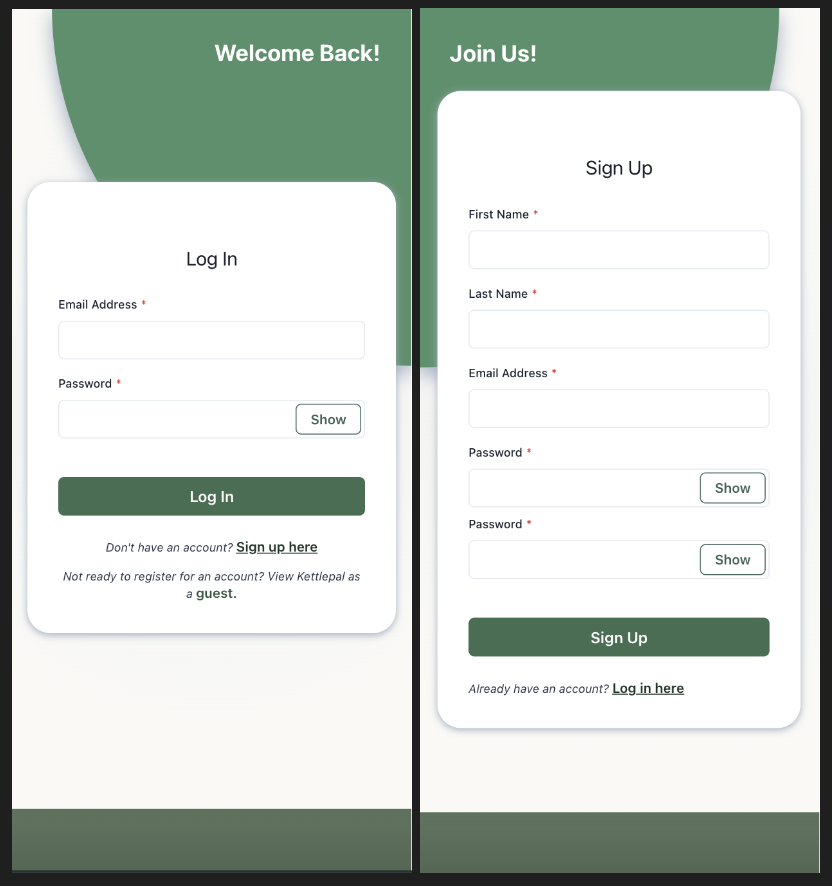
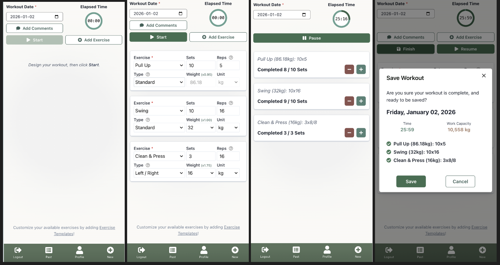
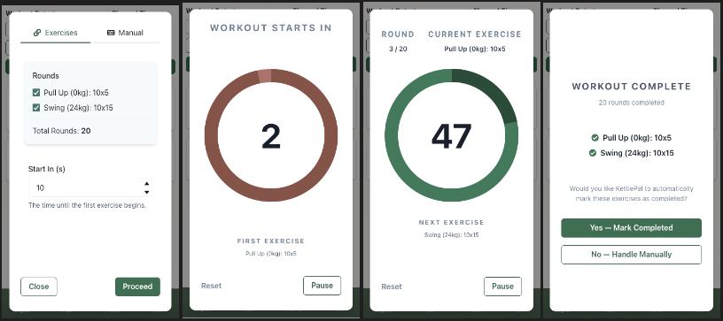
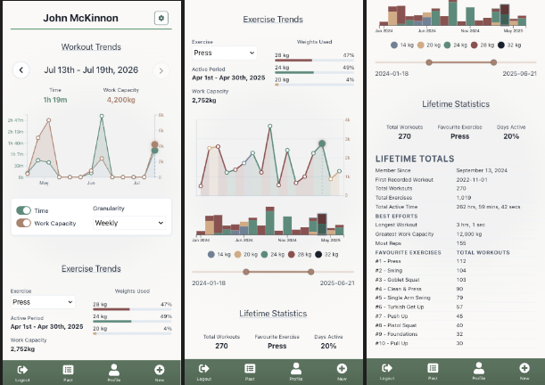
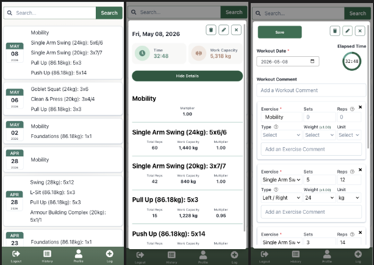
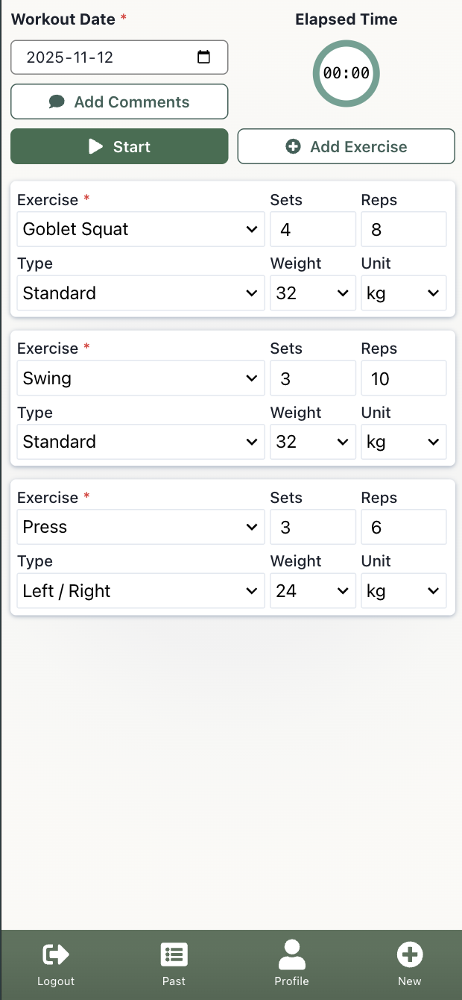

## Welcome to KettlePal!

KettlePal was built for two reasons:

1. To gain hands-on experience building a production grade full-stack application.
2. To quantitiatively track my kettlebell workouts over time, helping overcome plateaus by systematically increasing work capacity.

KettlePal has a small, but growing user-base. To cover the cloud computing costs, KettlePal will be moving to a donation-based payment model. As long as the donations roughly cover the fixed expenses, I have no intention of hiding the application behind a paywall.

## Access

### [**Live Deploy Link**](https://kettlepal.netlify.app/)

Make sure you **"_Add To Homescreen_"** on mobile devices for the best experience. KettlePal is a Progressive Web App (PWA).

## Tech Stack

- TypeScript
- React
- GraphQL
- PostgreSQL
- Docker
- Express
- Apollo
- ChakraUI
- D3.js

## Application Overview

### Authenticated User Profiles



### Design and Track Workouts



### EMOM Timer



### Track Progress Over Time



### View, Search, Analyze & Update Past Workouts



### Customize Your Exercise List



### Also Available on Desktop


## Feature List

- JWT Authentication, Registration/Login/Logout, Hashing.
- Design a workout, track your sets, then save the activity.
- Live EMOM timer with workout linking
- Personalized exercise list and work capacity computations.
- View past workouts chronologically, or search by relevant details.
- Visualize workout trends over time.
- Update past workouts.
- See all of your personal records in one spot.
- "Cook Mode" - keep device awake while tracking a workout.

## Road Map

- Build a password reset system.
- Add filters for quick sorting of past workouts.
- Let users customize the weight options available on the settings page.
- Integrate with Strava API to get data from bike rides and runs.

## Deployment

The production environment is built using free services (why it is not dockerized). This means down time can be expected on occasion, as CPU usage is limited. Services will be scaled as the user-base grows and donations cover the costs.

- Database
  - Hosted on Neon
- Backend Server
  - Hosted on Render
- Frontend
  - Hosted on Netlify

## Local Development with Docker

**First time only**: Copy the env files, substitute values:

```bash
cd Kettlepal/
cp ./.env.example ./.env
cp ./backend/graphql-server/.env.example ./backend/graphql-server/.env
```

Then spin up in one command:

```bash
docker compose up
```

This starts:

- **Frontend** (React) at `http://localhost:3000`
- **Backend** (GraphQL) at `http://localhost:4000/graphql`
- **Database** (PostgreSQL) with migrations and guest user seeded

### Common Commands

```bash
# Start all services
docker compose up

# Stop all services
docker compose down

# View logs
docker compose logs -f frontend
docker compose logs -f backend
```

### LLM Integration

For local development, I am using Claude Code with Ollama. For smaller tasks, use an on-prem model with unlimited access. For deeper reasoning, use a cloud-hosted model.
While both options are less powerfulthan a frontier model, they are completely free.

Run `ollama launch claude --model minimax-m3:cloud` to use Claude Code (with the minimax-m3 cloud model).

| Model      | Hosting Location | `command`                                       | Use Case                            |
| ---------- | ---------------- | ----------------------------------------------- | ----------------------------------- |
| minimax-m3 | Cloud            | `ollama launch claude --model minimax-m3:cloud` | Complex Reasoning.                  |
| qwen3.5:9b | On-Prem          | `ollama launch claude --model qwen3.5:9b`       | Small model, basic coding assitant. |

- `ollama run <model>` to start an on-prem model
- `ollama stop <model>` to end an on-prem model
- `ollama ps` to see actively running models
- `ollama list` to see all models saved on your computer
- `vim ~/.zshrc` to modify ollama context length
- `ollama serve` to validate the Ollama server is running
- `ollama list` to see available models
- Go to https://ollama.com/settings to see free usage limits.
