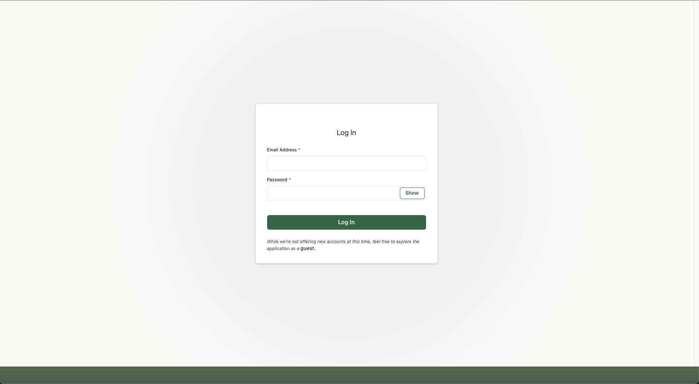

## Welcome to KettlePal!

An overbuilt, "_just-for-me_" learning project that was created to keep track of my personal kettlbell workouts, and track progress over time. Designed as a progressive web app for both mobile and desktop usage. Make you you "_Add To Homescreen_" on mobile devices for the best experience.

[**Live Deploy Link**](https://kettlepal.netlify.app/)

## Feature List

- JWT Authentication, Registration/Login/Logout, Hashing.
- Design a workout, track sets as you complete the exercises, then save the workout.
- View past workouts chronologically, or search by relevant details.
- Update past workouts at any time.
- Visualize workout trends over time.
- See all of your personal records in one spot.

## Road Map

- Create a settings page, where users can customize the list of exercises and weights shown when adding an exercise.
- Build a password reset system.
- Complete the "_YourProgression_" visualization to gain insight on trends for a specific exercise.
- Add filters for quick sorting of past workouts.
- Integrate with Strava API to get data from bike rides and runs.

## Tech Stack

- PostgreSQL
- GraphQL
- Express
- Apollo
- React
- TypeScript
- ChakraUI
- D3.js

## Deployment

The production environment is built using entirely free services. This means down time can be expected on occasion, as CPU usage is extremely limited.

- Database
  - Hosted on Neon
- Backend Server
  - Hosted on Render
- Frontend
  - Hosted on Netlify

## Application Overview

### Authenticated User Profiles

### Design and Track Workouts

### Review, Search, Analyze and Update Past Workouts

### Analyze Your Progress Over Time

### Also Available on Desktop

