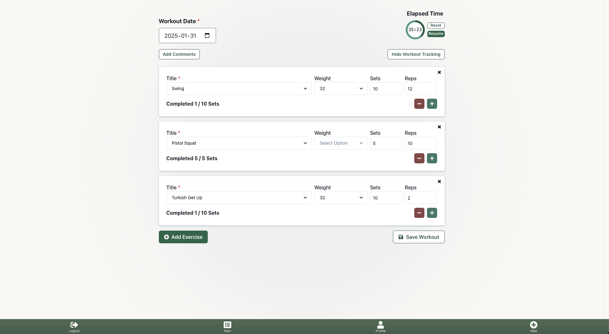
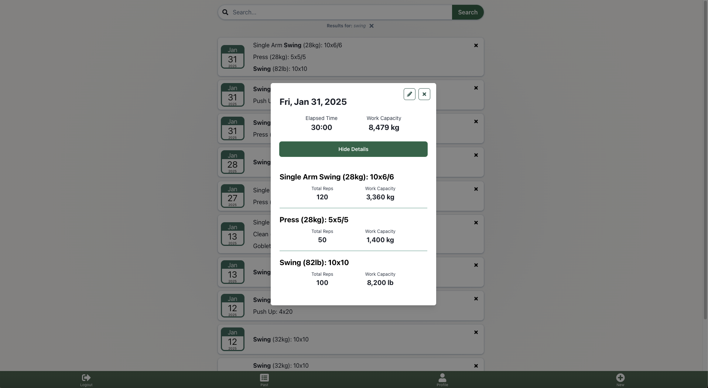

## Welcome to KettlePal!

An overbuilt "just-for-me" learning project that is made to keep track of my personal kettlbell workouts. Designed primarily for mobile use, with desktop support.

[**Live Deploy Link**](https://kettlepal.netlify.app/)

## Tech Stack

- PostgreSQL
- GraphQL
- Express
- Apollo
- React
- TypeScript
- ChakraUI

## Feature List

- JWT Authentication, Login/Logout, Hashing. (Sign Up is intentionally witheldfor the time being.)
- Design new workouts, track progress, and save to the database.
  - Client-side and server-side validation.
- Edit past workouts.
- View historical workout data.
- Fuzzy-Search historical workouts/exercises.
- View specific workouts in greater detail with computed information.
- Analyze histocial data visually.

## Road Map

- Add filters for quick sorting of past workouts.
- Use D3.js to show trends from your workout data.
- Integrate with Strava API to get data from bike rides and runs.

## Deployment

Development and production environments.

- Database
  - Hosted on Neon
- Backend Server
  - Hosted on Render
- Frontend
  - Hosted on Netlify

## Application Introducion

### Authenticated User Profiles

### Design and Track Workouts

### Review, Analyze and Update Past Workouts

### Analyze Your Progress Over Time

### Access on Mobile or Desktop Devices

